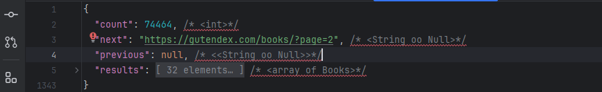
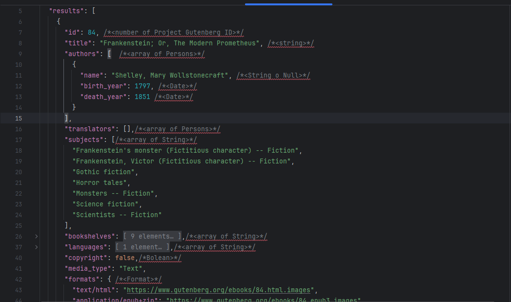

# Libro
Libros, aplicacion en java que consume API de libros

buscador de API :https://publicapis.dev/
Api a consumir: https://gutendex.com

### QUE HAE ESTA APLICACION?
* CONSUME DATOS DE LA API MOSTRANDO SOLO 5 DATOS DE LIBROS DE LOS MAS DE 7 MIL QUE TIENE LA AIP
  * direciion de la API con los libros en español https://gutendex.com/books/?languages=es
  * obtener datos de la api y juardarlos en json
  * ese json mapearlo con objectMapper
 
### Json de la API a Consumir




# Escructura del proyecto
- LibroApicarion
```java
	public static void main(String[] args) {SpringApplication.run(LibroApplication.class, args);}


	@Override
	public void run(String... args) throws Exception {
		Principal principal=new Principal();
		principal.muestraMenu();
	}
```
- service/ConsumoAPI
```java
public class ConsumoAPI {
    public String obtenerDatos(String url){
        HttpClient client=HttpClient.newHttpClient();
        HttpRequest request=HttpRequest.newBuilder()
                .uri(URI.create(url))
                .build();
        HttpResponse<String> response=null;
        try{
            response=client
                    .send(request,HttpResponse.BodyHandlers.ofString());
        } catch (IOException e) {
            throw new RuntimeException(e);
        }catch (InterruptedException e){
            throw new RuntimeException(e);
        }
        String json=response.body();
        return json;
    }
}
```
- service/IConvierteDatos
```java
public interface IConvertirDatos {
    /*
    * Metodo obtenerDatos de lipo generico osea:
    * <T> T obtenerDatos
    * a este metodo le pasamos 2 parametros un json que sera el que consumismo de la API  y un clase de tipo generica osea:
    * (String json, Class <T> clase)
    * */
    <T> T obtenerDatos (String json, Class <T> clase);
}
```
- service/ConvierteDatos
```java
public class ConvierteDatos implements IConvierteDatos {
    //cramos instancia de OdjectMapper que nos sirve para mapear el json
    private ObjectMapper mapper = new ObjectMapper();

    //implementamos la interface IConvertirDatos
    @Override
    public <T> T obtenerDatos (String json, Class <T> clase){
     try {
         //si todo sale bien retornamos el mapeo del json
         return mapper.readValue(json, clase);
     }catch (JsonProcessingException e){
         throw new RuntimeException(e);
     }
    }
}

```
- principal/Principal
````java
public class Principal {
    private static final String URL_BASE = "https://gutendex.com/books/";
    private ConsumoAPI consumoAPI=new ConsumoAPI();
    private ConvierteDatos conversor =new ConvierteDatos();


    public void muestraMenu(){
        var json=consumoAPI.obtenerDatos(URL_BASE);
        System.out.println(json);// muestra el json sin mapear
        
        /*Mapea todos los datos del json de estan en los record
        * los record no tienen todos los datos del json solo tienen los que solicitamos
        * los datos mapeados se  guardan en: var datos
        * conversor.obtenerDatos se encarga de mappear:
        * (json, Datos.class) que son el json y el record Datos
        * */
        var datos= conversor.obtenerDatos(json, Datos.class);
        
    }
}
````
- model/Datos
````java
/*En este record vamos a guardar los datos que mapeamos del json, los datos que estan en la lista de results.
* los pasamos como parametro de  la clase: DatosLibros que tambien es un record
* */

@JsonIgnoreProperties(ignoreUnknown = true)
public record Datos(
        @JsonAlias ("results") List<DatosLibro> libros //lista de DatosLibro que es un record
) {}
````
- model/DatosAutor
```java
@JsonIgnoreProperties(ignoreUnknown = true)
public record DatosAutor(
        @JsonAlias ("name") String Nombre,
        @JsonAlias ("birth_year") String fechaNacimiento,
        @JsonAlias ("death_year") String fechaDefincion
) {}
```
- model/DatosLibro
```java
@JsonIgnoreProperties(ignoreUnknown = true)
public record DatosLibro(
        @JsonAlias("title") String titulo,
        @JsonAlias("authors") List<DatosAutor> autor,
        @JsonAlias("languages") List<String> idiomas,
        @JsonAlias("download_count") Double numeroDeDescargas
) {}
```


## como mapear con objectMapper?
-Declarar dependencia
```java
	<dependency>
	  <groupId>com.fasterxml.jackson.core</groupId>
	  <artifactId>jackson-databind</artifactId>
	  <version>2.18.0</version>
	</dependency>
```

* TOP 10 DE LOS MAS DSCARGADOS
```java
        //Top 10 de libros mas descargados
        System.out.println("TOP 10 de libros mas descargados" );
        datos.libros().stream()// accedemos a la lista de libros y aplicamos stream
                /*.sorted Odenamos los elementos de menor a mayor de numero de descagas
                * .reversed invertimos el orden de mayo a menor*/
                .sorted(Comparator.comparing(DatosLibro::numeroDeDescargas).reversed())
                .limit(10) // limitamos el contenido a 10 elementos
                        .map(l->l.titulo().toUpperCase())// Convertimos los titulosen mayusculas
                .forEach(System.out::println);
```
* BUSCAR LIBRO POR NOMBRE EN ESPAÑOL(PUEDE SER SOLO UNA PARTE DEL TITULO DEL LIBRO)
````java
        //Busqueda de libro por nombre
        System.out.println("Ingrese el nombre del libro a Buscar");
        var tituloLibro=teclado.nextLine();
        json= consumoAPI.obtenerDatos(URL_BASE+"?search="+tituloLibro.replace(" ","+"));
        var datosBusqueda=conversor.obtenerDatos(json,Datos.class);
        /*Optional es un clase ya definida en java: dependiendo si encuentra o no un resultado lo almasena en un conteiner y se hace un tratamiento de datos:
        * Container:Optional<DatosLibro>libroBuscado=datosBusqueda
        * Tratamiento:datosBusqueda.libros().stream()
        * */
        Optional<DatosLibro>libroBuscado=datosBusqueda.libros().stream()
                .filter(l->l.titulo().toUpperCase().contains(tituloLibro.toUpperCase()))//itera sobre titulo en mayusculas y busca el titulo en matusculas
                .findFirst();//solo el primer resultado
        if (libroBuscado.isPresent()){
            System.out.println("Libro Encontrado");
            System.out.println(libroBuscado.get());
        }else {
            System.out.println("Libro no encontrado");
        }
````
Nota: esta API de libros soporta la busqueda de titulos por fracmentos del titulo y tiene soporte para barios idiomas, es decir podemos vuscar el titulo en aleman, ingles, español, etc,,
* MOSTRAR ESTADISTICAS DE LOS LIBROS
````java
//trabajando con estadisticas
        /*Checamos que tipo de variable es numero de descargas, que es donde vamos a enfocar las estadisticas, en este caso es un double
         *y usamos: DoubleSummaryStatistics lo guartamos en est
         *
         */
        DoubleSummaryStatistics est =datos.libros().stream()
                .filter(d->d.numeroDeDescargas()>0)//filtramos solo descargar mallores a 0
                .collect(Collectors.summarizingDouble(DatosLibro::numeroDeDescargas));//" .collect(Collectors.summarizingDouble" mos ayuda a generar nustas estalisticas de las descargas
        System.out.println("Cantidad media de descargas; "+est.getAverage());
        System.out.println("Cantidad maxima de descargas; "+est.getMax());
        System.out.println("Cantidad minima de descargas; "+est.getMin());
        System.out.println("Cantidad de registros evaluados ; "+est.getCount());

    }
````


